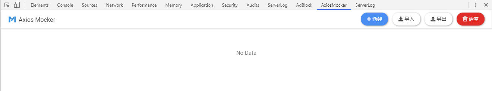
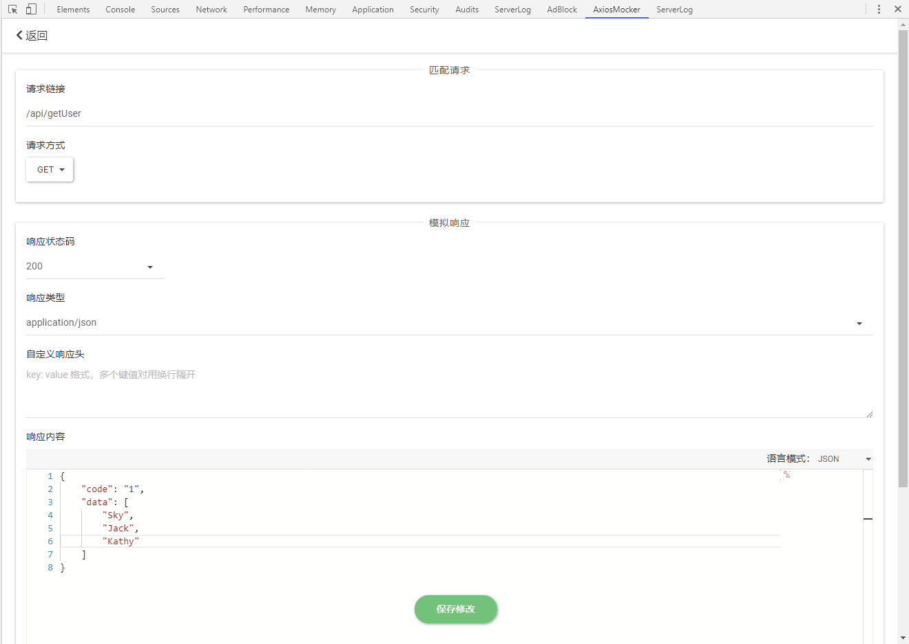
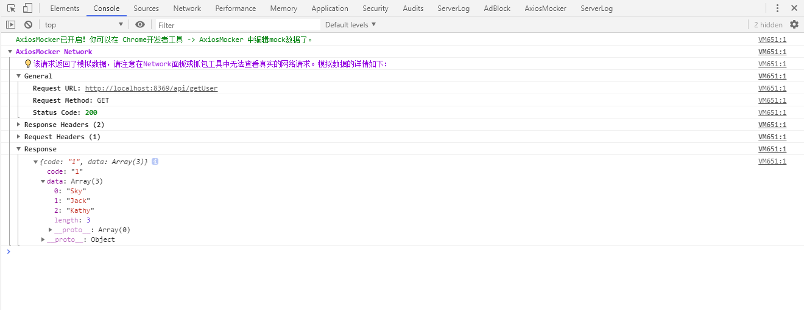
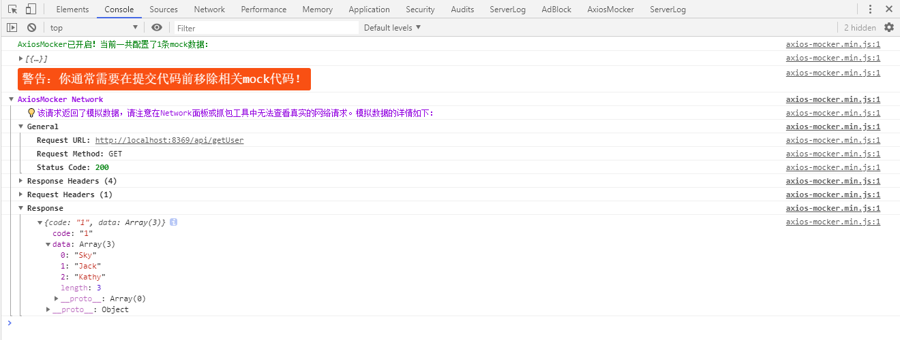

<a href="https://github.com/eshengsky/axios-mocker"></a>

# axios-mocker

[English Document](https://github.com/eshengsky/axios-mocker/blob/master/README.md)  
axios 库最方便的请求模拟工具，内置 Chrome 扩展程序支持。

[](https://travis-ci.org/eshengsky/axios-mocker)

## 目录
- [为什么需要模拟请求](#为什么需要模拟请求)
- [快速开始](#快速开始)
  * [方式一 (推荐)](#方式一-推荐)
    + [安装](#安装)
    + [使用](#使用)
    + [示例](#示例)
    + [权限问题](#权限问题)
  * [方式二](#方式二)
    + [安装](#安装-1)
    + [使用](#使用-1)
    + [示例](#示例-1)
  * [数据共用](#数据共用)
- [示例页面](#示例页面)
- [打包](#打包)
- [测试](#测试)
- [Mocker](#mocker)
- [许可](#许可)

## 为什么需要模拟请求
* 你无需再等待依赖的接口开发并部署完成，只需要定义好接口字段，前后端就可以并行开发了。
* 有的接口可能会污染生产环境的数据，此时通过模拟请求，指定你想要的响应，就不会发送真实的请求了。
* 很多时候，接口可能会返回各种类型的响应，开发与测试人员需要验证在不同返回下代码是否都正常工作，例如：当接口 500 时，页面是否能如预期进行展示。通过正常操作创造这些数据，有时会特别繁琐或非常困难，而使用模拟请求就方便了，想返回什么就返回什么，也能高效地进行边界测试。
* 是TDD（测试驱动开发）以及自动化测试的基石。

## 快速开始

axios-mocker 支持两种使用方式，这两种方式的安装和使用会有所差异。

### 方式一 (推荐)

这是 axios-mocker 独创的使用方式。如果你的大部分开发和测试工作，都是在 Chrome 桌面浏览器环境下进行的，那这种使用方式的体验将会很酷。

#### 安装

1. 在 [Release](https://github.com/eshengsky/axios-mocker/releases/latest) 页面下载最新版本的压缩包；
2. 打开 Chrome 浏览器，在地址栏输入 `chrome://extensions/` 进入 Chrome 扩展页面，勾选"开发者模式"；
3. 将下载后的压缩包解压缩成文件夹拖到页面中，点击"添加扩展程序"按钮；
4. 按 `Ctrl+Shift+I` 打开开发者工具，你会发现多出来一个 `AxiosMocker` 面板。

#### 使用

在安装完上述扩展程序后，所有页面中都将自动注入一个挂载在 `window` 下的全局类 `AxiosMockerExt`。也就是说，你并不需要再引入某个模块，你可以直接使用这个类 —— 将它实例化，并传入一个 axios 的实例。

```js
new AxiosMockerExt(axios);
```

传统的 mock 库通常需要在提交代码前，手动移除相关 mock 代码。这里**并不需要**，你要做的仅仅是判断一下 `AxiosMockerExt` 变量是否存在。

```js
if (window.AxiosMockerExt) {
  new AxiosMockerExt(axios);
}
```

这样做的好处是：

1. 即使发布到了生产环境，也不会对普通用户产生影响。
1. 你可以在生产环境使用 mock 数据进行调试，而不再局限于本地开发环境。

#### 示例

假设我们需要获取一个用户列表：

```js
// 引入axios模块
const axios = require("axios");

// 发送一个请求
axios.get("/api/getUser").then(resp => {
  console.log(resp.data);
});
```

在引入 axios 之后，并在其它代码之前，加入 mock 代码：

```js
// 引入axios模块
const axios = require("axios");

// 判断存在与否并实例化AxiosMockerExt
if (window.AxiosMockerExt) {
  new AxiosMockerExt(axios);
}

// 发送一个请求
axios.get("/api/getUser").then(resp => {
  console.log(resp.data);
});
```

在 Chrome 浏览器中，按下 `Ctrl+Shift+I` 打开开发者工具，进入 `AxiosMocker` 扩展面板。



点击新建按钮，输入你想要的 mock 数据。  
在 `匹配请求` 面板，设置哪些匹配的请求需要进行模拟；在 `模拟响应` 面板，设置你想要返回的响应内容。



点击保存（Ctrl+S），使改动生效。然后刷新页面，此时你会发现，获取到的用户列表是你刚刚在扩展程序中配置的 mock 数据。

需要注意的是如果有匹配的 mock 数据，真实的接口请求将**不会**发送，因此你在 Network 面板或抓包工具中都看不到相应记录。但你可以在 Console 控制台看到 AxiosMocker Network：



#### 权限问题

默认情况下，AxiosMocker 扩展程序支持当前页面的 host 是 `localhost` 或 `127.0.0.1` 两种情况。当你尝试在其它 host 下的页面上启用 mock 功能时，可能会在控制台看到这样的警告信息：`向AxiosMocker扩展程序发送消息时失败，可能是没有配置mock权限`。此时你需要手动配置相关权限：

打开你下载并解压缩后的文件夹根路径下的 `manifest.json` 文件，修改 `externally_connectable` 字段。例如：你的当前页面的域名是 `m.example.com`，则修改为：

```json
"externally_connectable": {
    "matches": ["*://localhost/*", "*://127.0.0.1/*", "*://m.example.com/*"]
}
```
再次访问 `chrome://extensions/`，重新加载 AxiosMocker 扩展程序。

### 方式二

这是一个通用型方式，与其它 mock 库类似，你需要临时添加一些 mock 代码，在提交代码前通常需要移除它们。

#### 安装

使用 npm:

```bash
$ npm i --save-dev axios-mocker
```

或者使用 `script` 标签引入：  
https://unpkg.com/axios-mocker/dist/axios-mocker.js  
https://unpkg.com/axios-mocker/dist/axios-mocker.min.js

#### 使用

引入 `AxiosMocker` 类后，与方式一类似，实例化这个类，第 1 个参数传入一个 axios 的实例，第 2 个参数是一个数组，表示 mock 数据的集合。

```js
const AxiosMocker = require("axios-mocker");
new AxiosMocker(axios, [options]);
```

`options` 对象支持如下属性：

<table>
    <tr>
        <th>属性名</th>
        <th>说明</th>
        <th>值类型</th>
    </tr>
    <tr>
        <td>req</td>
        <td>需要匹配的请求对象</td>
        <td>object</td>
    </tr>
    <tr>
        <td>req.url</td>
        <td>请求的Url，模糊匹配，必填</td>
        <td>string</td>
    </tr>
    <tr>
        <td>req.method</td>
        <td>请求方式，如 Get, Post 等，默认值 Get</td>
        <td>string</td>
    </tr>
    <tr>
        <td>res</td>
        <td>需要模拟的响应对象</td>
        <td>object</td>
    </tr>
    <tr>
        <td>res.statusCode</td>
        <td>响应状态码，必填</td>
        <td>number</td>
    </tr>
    <tr>
        <td>res.headers</td>
        <td>自定义响应头</td>
        <td>object</td>
    </tr>
    <tr>
        <td>res.contentType</td>
        <td>Content-Type，默认值 application/json</td>
        <td>string</td>
    </tr>
    <tr>
        <td>res.body</td>
        <td>响应内容，默认值 null</td>
        <td>string/object</td>
    </tr>
    <tr>
        <td>res.delay</td>
        <td>响应延迟，单位毫秒，默认值 0</td>
        <td>number</td>
    </tr>
</table>

#### 示例

同样假设我们需要获取一个用户列表：

```js
// 引入axios模块
const axios = require("axios");

// 发送一个请求
axios.get("/api/getUser").then(resp => {
  console.log(resp.data);
});
```

在引入 axios 之后，并在其它代码之前，加入 mock 代码：

```js
// 引入axios模块
const axios = require("axios");

// 引入并实例化axios-mocker
const AxiosMocker = require("axios-mocker");
new AxiosMocker(axios, [
  {
    req: {
      url: "/api/getUser",
      method: "GET"
    },
    res: {
      statusCode: 200,
      headers: {
        test: 123,
        "foo-bar": "baz"
      },
      contentType: "application/json",
      body: {
        code: "1",
        data: ["Sky", "Jack", "Kathy"]
      },
      delay: 1000
    }
  }
]);

// 发送一个请求
axios.get("/api/getUser").then(resp => {
  console.log(resp.data);
});
```

刷新页面，此时你会发现，获取到的用户列表是你刚刚配置的 mock 数据。

需要注意的是如果有匹配的 mock 数据，真实的接口请求将**不会**发送，因此你在 Network 面板或抓包工具中都看不到相应记录。但你可以在 Console 控制台看到 AxiosMocker Network：



### 数据共用

方式一和方式二的 mock 数据是可以共用的。

方式一中使用 Chrome 扩展程序创建的 mock 数据，可以点击界面上的导出按钮生成一个 `json` 文件，并用在方式二中：

```js
new AxiosMocker(axios, require("./axios-mocker-data.json"));
```

而方式二在代码中创建的 mock 数据，也可以通过手动保存为一个 `json` 文件，点击扩展程序中的导入按钮，应用到方式一中。

## 示例页面

在 `/example/` 目录下包含了 2 个完整示例。先通过如下脚本启动服务：

```bash
$ npm run example
```

这是方式一的示例页：  
http://localhost:8369/example/index1.html

这是方式二的示例页：  
http://localhost:8369/example/index2.html

## 打包

```bash
$ npm run build
```

## 测试

```bash
$ npm test
```

## Mocker
axios-mocker 仅支持 axios 库，如果你正在寻找通用的 mock 解决方案，可以尝试基于本地代理服务器的 [Mocker](https://github.com/eshengsky/Mocker)。

## 许可

MIT License

Copyright (c) 2019 Sky.Sun 孙正华

Permission is hereby granted, free of charge, to any person obtaining a copy
of this software and associated documentation files (the "Software"), to deal
in the Software without restriction, including without limitation the rights
to use, copy, modify, merge, publish, distribute, sublicense, and/or sell
copies of the Software, and to permit persons to whom the Software is
furnished to do so, subject to the following conditions:

The above copyright notice and this permission notice shall be included in all
copies or substantial portions of the Software.

THE SOFTWARE IS PROVIDED "AS IS", WITHOUT WARRANTY OF ANY KIND, EXPRESS OR
IMPLIED, INCLUDING BUT NOT LIMITED TO THE WARRANTIES OF MERCHANTABILITY,
FITNESS FOR A PARTICULAR PURPOSE AND NONINFRINGEMENT. IN NO EVENT SHALL THE
AUTHORS OR COPYRIGHT HOLDERS BE LIABLE FOR ANY CLAIM, DAMAGES OR OTHER
LIABILITY, WHETHER IN AN ACTION OF CONTRACT, TORT OR OTHERWISE, ARISING FROM,
OUT OF OR IN CONNECTION WITH THE SOFTWARE OR THE USE OR OTHER DEALINGS IN THE
SOFTWARE.
