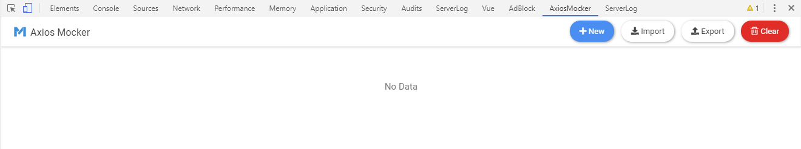
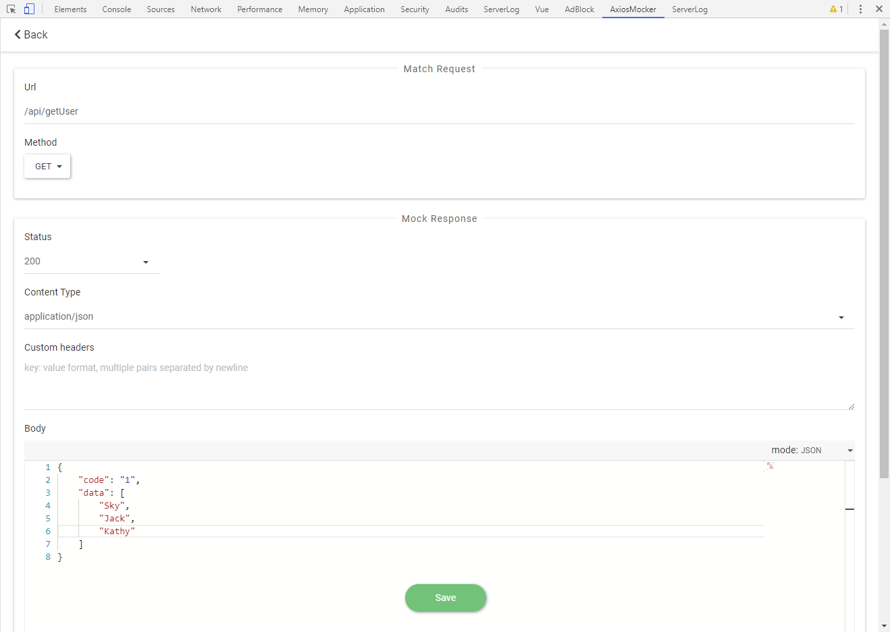
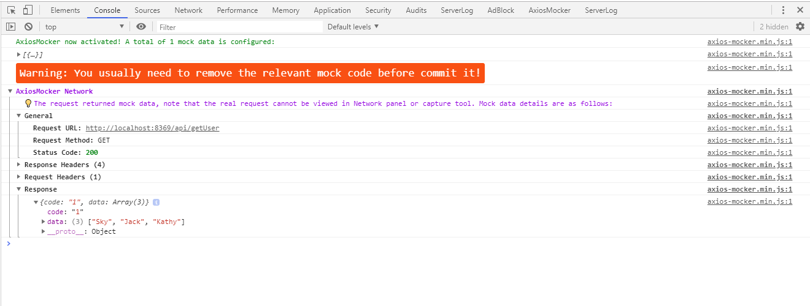

# axios-mocker

[中文文档](https://github.com/eshengsky/axios-mocker/blob/master/README-zh.md)  
The most convenient tool to mock requests for axios, with built-in Chrome extension support.

## Table of Contents
- [Why need mock requests](#why-need-mock-requests)
- [Quick Start](#quick-start)
  * [Mode One (Recommended)](#mode-one-recommended)
    + [Installation](#installation)
    + [Usage](#usage)
    + [Example](#example)
    + [Permission Issue](#permission-issue)
  * [Mode Two](#mode-two)
    + [Installation](#installation-1)
    + [Usage](#usage-1)
    + [Example](#example-1)
  * [Data Sharing](#data-sharing)
- [Example Pages](#example-pages)
- [Package](#package)
- [Test](#test)
- [Mocker](#mocker)
- [Licence](#licence)

## Why need mock requests
* Instead of waiting for the dependent web service to develop and deploy, you just need to define the interface fields and the front back end can be developed in parallel.
* Some web service may contaminate the data in the production environment, while the real request will not be sent by simulating the request and specifying the response you want. 
* Many times, the web service may return various types of responses, and developers and testers need to verify if it is working correctly under different returns, for example, when web service status code is 500, the page can be displayed as expected. Creating the data through normal operations can sometimes be particularly cumbersome or difficult, while using mock requests is convenient, and boundary testing can be done efficiently if you want to return what you want. 
* It is the base of TDD (test-driven development) and automated testing.

## Quick Start

axios-mocker supports two ways of usages, and the installation and use of the two mode may vary.

### Mode One (Recommended)

This is the original way of using axios-mocker. If most of your development and testing efforts are done in the Chrome desktop browser environment, the experience of using it will be cool.

#### Installation

1. Download the latest package in [Release](https://github.com/eshengsky/axios-mocker/releases/latest) page.
2. Open Chrome, enter `chrome://extensions/` in the address bar to enter the Chrome extension page, and check the `Developer mode`.
3. Unzipped the package file into a folder and dragged to the page, and click on the `Add Extension` button.
4. Press `Ctrl+Shift+I` to open the developer tool and you'll find one more `AxiosMocker` panel.

#### Usage

After installing the above extension, a global class `AxiosMockerExt` mounted under `window` will be automatically injected into all pages. That is, you don't need to reference a module, you can use the class directly -- instantiate it and pass it in an instance of axios.

```js
new AxiosMockerExt(axios);
```

Traditional mock libraries typically require manual removal of the relevant mock code before committing it. Here you **don't need to**, all you have to do is judge if the `AxiosMockerExt` variable exists.

```js
if (window.AxiosMockerExt) {
  new AxiosMockerExt(axios);
}
```

The benefits of this are:

1. Even if it is published into production environment, it will not affect common users.
2. You can use mock data for debugging in a production environment, rather than being limited to local development environment.

#### Example

Let's say we need to get a list of users:

```js
// require axios module
const axios = require("axios");

// send request with axios
axios.get("/api/getUser").then(resp => {
  console.log(resp.data);
});
```

After the refer of axios, and before other codes, add the mock code:

```js
// require axios module
const axios = require("axios");

// determine whether it exists and instantiate AxiosMockerExt
if (window.AxiosMockerExt) {
  new AxiosMockerExt(axios);
}

// send request with axios
axios.get("/api/getUser").then(resp => {
  console.log(resp.data);
});
```

In Chrome browser, press `Ctrl+Shift+I` to open development tool, go to `AxiosMocker` extension panel.



Click the `New` button, and enter the mock data you want.  
In `Match Request` panel, set which matching requests need to be simulated, and in `Mock Response` panel, set the content of the response you want to return.



Click `Save` (Ctrl+S), make the changes effective. Then refresh the page, and you'll see that the list of users you get is the mock data you just configured in the extension.

Note that if there is a matching mock data, the real web request will **not** be sent, so you won't see the record in the Network panel or in the grab tool. While you can see `AxiosMocker Network` in the Console:


#### Permission Issue

By default, the AxiosMocker extension supports the current page's host as `localhost` or `127.0.0.1` in both cases. When you try to enable the mock feature on pages under other hosts, you may see this warning message in the console: `Failed to send messages to AxiosMocker extension, probably without configuring mock permissions`. At this point, you need to manually configure the permissions as following:

Open the `manifest.json` file under the root path of the folder you downloaded and unzipped, and modify the `externally-connectedable` field. For example, if the domain name of your current page is `m.example.com`, can be modified to:

```json
"externally_connectable": {
    "matches": ["*://localhost/*", "*://127.0.0.1/*", "*://m.example.com/*"]
}
```
Visit `chrome://extensions/` again, reload the AxiosMocker extension.

### Mode Two

This is a generic approach, similar to other mock libraries, where you need to temporarily add some mock code, which you often need to remove before committing it.

#### Installation

Using npm:

```bash
$ npm i --save-dev axios-mocker
```

Or reference with `script` tag:  
https://unpkg.com/axios-mocker/dist/axios-mocker.js  
https://unpkg.com/axios-mocker/dist/axios-mocker.min.js

#### Usage

After the refer `AxiosMocker` class, similar to the Mode One, instantiates the class, the first argument passes an instance of axios, and the second argument is an array that represents a collection of Mock data.

```js
const AxiosMocker = require("axios-mocker");
new AxiosMocker(axios, [options]);
```

The `options` object has following properties:

<table>
    <tr>
        <th>Property Name</th>
        <th>Description</th>
        <th>Type</th>
    </tr>
    <tr>
        <td>req</td>
        <td>The request need to be matched</td>
        <td>object</td>
    </tr>
    <tr>
        <td>req.url</td>
        <td>Request URL, fuzzy match, required</td>
        <td>string</td>
    </tr>
    <tr>
        <td>req.method</td>
        <td>Request method, like Get, Post..., default: Get</td>
        <td>string</td>
    </tr>
    <tr>
        <td>res</td>
        <td>The response need to be simulated</td>
        <td>object</td>
    </tr>
    <tr>
        <td>res.statusCode</td>
        <td>Response status code, required</td>
        <td>number</td>
    </tr>
    <tr>
        <td>res.headers</td>
        <td>Custom response headers</td>
        <td>object</td>
    </tr>
    <tr>
        <td>res.contentType</td>
        <td>Content-Type, default: application/json</td>
        <td>string</td>
    </tr>
    <tr>
        <td>res.body</td>
        <td>Response body, default: null</td>
        <td>string/object</td>
    </tr>
    <tr>
        <td>res.delay</td>
        <td>Response delay, milliseconds, default: 0</td>
        <td>number</td>
    </tr>
</table>

#### Example

Let's say we need to get a list of users:

```js
// require axios module
const axios = require("axios");

// send request with axios
axios.get("/api/getUser").then(resp => {
  console.log(resp.data);
});
```

After the refer of axios, and before other codes, add the mock code:

```js
// require axios module
const axios = require("axios");

// require and instantiate AxiosMocker
const AxiosMocker = require("axios-mocker");
new AxiosMocker(axios, [
  {
    req: {
      url: "/api/getUser",
      method: "GET"
    },
    res: {
      statusCode: 200,
      headers: {
        test: 123,
        "foo-bar": "baz"
      },
      contentType: "application/json",
      body: {
        code: "1",
        data: ["Sky", "Jack", "Kathy"]
      },
      delay: 1000
    }
  }
]);

// send request with axios
axios.get("/api/getUser").then(resp => {
  console.log(resp.data);
});
```

Refresh the page, you'll see that the list of users you get is the mock data you just configured.

Note that if there is a matching mock data, the real web request will **not** be sent, so you won't see the record in the Network panel or in the grab tool. While you can see `AxiosMocker Network` in the Console:



### Data Sharing

The mock data for Mode One and Mode Two can be shared.

Using the mock data created by the Chrome extension in Mode One, you can create a `json` file by clicking on the `export` button on the interface and using it in Mode TWO:

```js
new AxiosMocker(axios, require("./axios-mocker-data.json"));
```

The mock data created in the code by Mode Two can also be applied to Mode One by manually saving it as a `json` file, clicking on the import button in the extension.

## Example Pages

There are two example pages under `/example/` folder. Run server as:

```bash
$ npm run example
```

This is an example page for Mode One:  
http://localhost:8369/example/index1.html

This is an example page for Mode Two:  
http://localhost:8369/example/index2.html

## Package

```bash
$ npm run build
```

## Test

```bash
$ npm test
```

## Mocker
axios-mocker only supports the axios library, if you are looking for a common mock solution, try the proxy server based tool [Mocker](https://github.com/eshengsky/Mocker).

## Licence

MIT License

Copyright (c) 2019 Sky.Sun 孙正华

Permission is hereby granted, free of charge, to any person obtaining a copy
of this software and associated documentation files (the "Software"), to deal
in the Software without restriction, including without limitation the rights
to use, copy, modify, merge, publish, distribute, sublicense, and/or sell
copies of the Software, and to permit persons to whom the Software is
furnished to do so, subject to the following conditions:

The above copyright notice and this permission notice shall be included in all
copies or substantial portions of the Software.

THE SOFTWARE IS PROVIDED "AS IS", WITHOUT WARRANTY OF ANY KIND, EXPRESS OR
IMPLIED, INCLUDING BUT NOT LIMITED TO THE WARRANTIES OF MERCHANTABILITY,
FITNESS FOR A PARTICULAR PURPOSE AND NONINFRINGEMENT. IN NO EVENT SHALL THE
AUTHORS OR COPYRIGHT HOLDERS BE LIABLE FOR ANY CLAIM, DAMAGES OR OTHER
LIABILITY, WHETHER IN AN ACTION OF CONTRACT, TORT OR OTHERWISE, ARISING FROM,
OUT OF OR IN CONNECTION WITH THE SOFTWARE OR THE USE OR OTHER DEALINGS IN THE
SOFTWARE.
